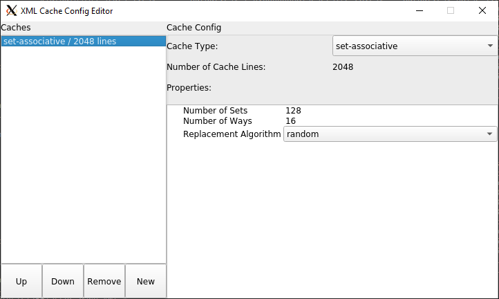

# CacheFX: A framework for evaluating the security of caches.

## About

Over the last two decades, the danger of sharing resources between programs has
been repeatedly highlighted.
Multiple side-channel attacks, which exploit shared components for
leaking information, have been devised,
mostly exploiting shared caching components.
In response, the research community has proposed multiple cache designs that
aim at curbing these information leaks.

With multiple competing designs, there is a need for assessing
the level of security against side-channel attacks that each design offers.
Several metrics have been suggested for performing such evaluations.
However, these tend to be limited both in terms of the potential adversaries
they consider and in the applicability of the metric to real-world attacks,
as opposed to attack techniques. Moreover, all existing metrics implicitly
assume that a single metric can encompass the nuances of side-channel security.

In this work we propose a flexible framework for assessing and
evaluating the resilience of cache designs to side-channel attacks.
CacheFX allows the evaluator to implement various cache designs, victims, and
attackers, as well as to exercise them for assessing the leakage of information
via the cache.

## Required packages
CacheFX requires some packages to be installed in order to be succesfully built.
Among them are:

* Qt5
* pugixml

These can be installed using the following commands

**Ubuntu**:  
`$ sudo apt install qt5-dev`

`$ git submodule init && git submodule update`

## Build

To build CacheFX, simply run the command
`$ make ` 
inside the code directory.

Two executables will be created upon a successful build:

* cachefx: The main executable for running experiments.
* gui: The graphical user interface for creating and editing different cache configurations. 

## Running CacheFX

To run CacheFX, simply execute the cachefx executable with the desired flags

`$ ./cachefx ` flags

|Flag|Description|
|----|-----------|
| `-c`          | cache configuration file, used to model the cache design in the experiment                         |
| `-o` | Output file location |
| `-m` | Type of measurement to run (entropy, profiling, efficiency or attacker) |
| `-v` | Type of victim program to model (AES, or SquareMult)                |
| `-a`      | Type of attacker to use (occupancy, or eviction) |
| `-v` | Type of victim program to model (AES, or SquareMult)                |
| `-t` | Type of efficiency attack (probability, size, noise, or heatmap)                |
| `-l` | Starting point of experiment / vertical axis for heatmap (number) |
| `-z` | Starting point of horizontal axis for heatmap (number) |
| `-e` | End point of experiment / vertical axis for heatmap (number) |
| `-y` | End point of horizontal axis for heatmap(number) |
| `-i` | Step size of experiment / vertical axis for heatmap (number) |
| `-n` | Step size of horizontal axis for heatmap (number) |
| `-p` | Allow measurement to include self eviction (allow, or disallow) |
| `-r` | How many times to run the attack (number) |
| `-g` | Number of encryption to try before an attacker gives up (number) |
| `-h` | Show help |

**Type of measurements**
CacheFX allows different measurement types such as entropy, eviction set building profiling, cryptographic key attack, and attack efficiency.

Described below are the details of these modes

 |Flag|Description|
|----|-----------|
| `entropy`          | Evaluates the information leakage (in terms of bits) for a single line access by a victim|
| `profiling` | Evaluates the difficulty of eviction set building for different cache configurations |
| `attacker` | Measure the susceptibility of a cache against cryptographic attacks |
| `efficiency` | Evaluates the correlation of different attack properties against cryptographic attacks |

**Type of efficiency attack**

This mode allows evaluating different properties of eviction sets such as eviction probability, eviction set size, "random noise" and heatmaps (eviction set size for vertical axis and "random noise" for horizontal axis

"Random Noise" is described as the accesses to some random addresses by an attacker in an effort to evict some of the victim's lines to prevent them being resident in the cache.

The different modes are describe in more detail in the table below

|Flag|Description|
|----|-----------|
| `probability`          | Evaluates the effect of eviction probability of cache sets against cryptographic key attacks |
| `size` | Evaluates the effect of eviction set size against cryptographic key attacks |
| `noise` | Evaluates the effect of "Random Noise" against cryptographic key attacks |
| `heatmap` | Evaluates a combination of size and "Random Noise" in a form of a heatmap |

An example of the command used to generate a 50 x 50 heatmap for an AES attack for a 16 way, 2048 lines fully associative cache with random line replacement policy. The heatmap generated has a step size of 5 for both the vertical (set size) and horizontal ("Random Noise") axis, and has a start point of 0 and ends at 245 for both axis

`$ ./cachefx -v AES -c configs/cl2048/w16/setassoc_rand.xml -m efficiency -t heatmap -l 0 -e 245 -i 5 -z 0 -y 245 -n 5`

Output of this heatmap consists of the following columns:

|Flag|Description|
|----|-----------|
| `Eviction Set Size`          | The size of the eviction set (Y axis) |
| `Noise Size` | The size of the "Random Noise" (X axis) |
| `Accesses` | The number of memory accesses required to break the encryption |
| `Encryptions` | The number of encryptions needed to be observed by the attacker to break the encryption |
| `Eviction Probability` | The probability of the current eviction set size to evict the victim's target address |
| `Noise Accesses` | The total number of sets of "Random Noise" accessed |
| `Self Eviction Rate` | The rate of self eviction for the current eviction set size |
| `Unique Victim Lines` | The number of unique victim lines that evicts any address in the attacker's eviction set |
| `Real Evictions` | The rate of an attacker's eviction set evicted by a victim's target address (I.e How accurate the eviction set targets its victim's line of interest) |

## Using the Cache Configuration Editor
To use the cache configuration editor, simply run the following command

`$ ./gui`

This will launch the graphical user interface for the cache editor, this utility can be used to create new, and modify existing cache configurations.

## Acknowledgments
This project has been supported by
* An ARC Discovery Early Career Researcher Award (project number DE200101577)
* An ARC Discovery Project (project number DP210102670)
* The Blavatnik ICRC at Tel-Aviv University
* Data61, CSIRO
* a gift from Intel
